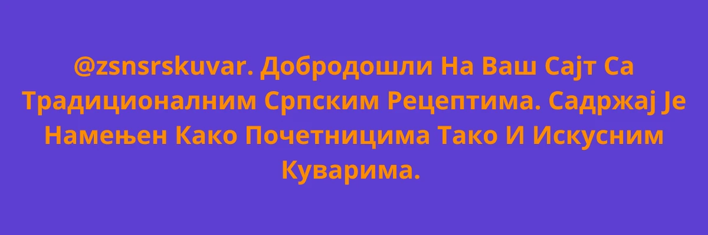

<p align="center">
  
</p>
**Сав садржај је кодиран у ХТМЛ, ЦСС, ЈаваСцрипт и СВГ технологијама као интерактивна дигитална уметност.**

---

### ДИЗАЈН И ТЕХНОЛОГИЈЕ
**HTML5**
**CSS3**
**JavaScript**
**SVG**

---

### 🚀 КАКО ПОКРЕНУТИ  ВЕБ САЈТ
1. Преузмите све фајлове на свој рачунар.
2. Пронађите главну страницу у фолдеру.
3. Отворите фајл двокликом у вашем веб прегледачу.
```text
index.html
```
